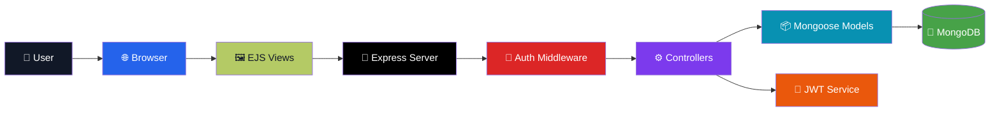
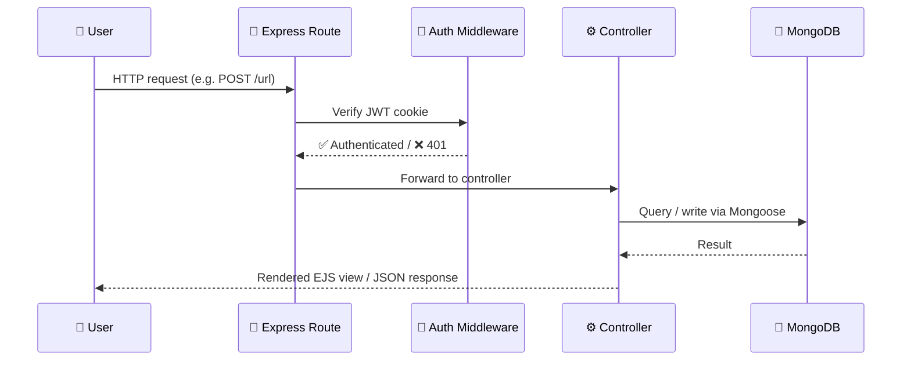
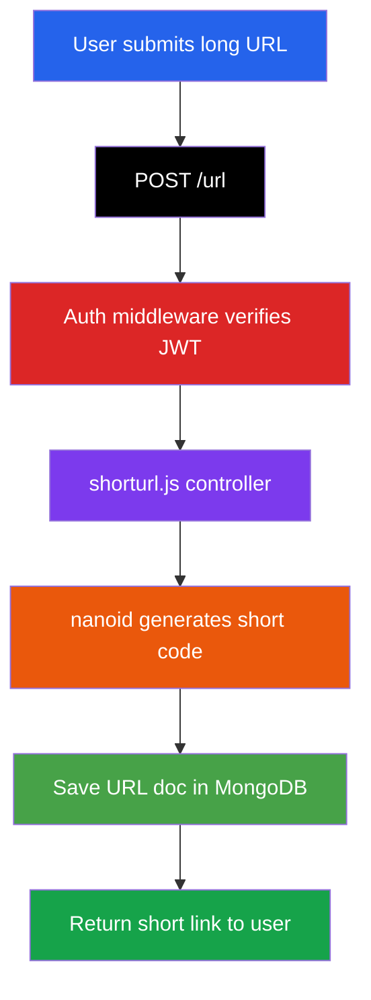
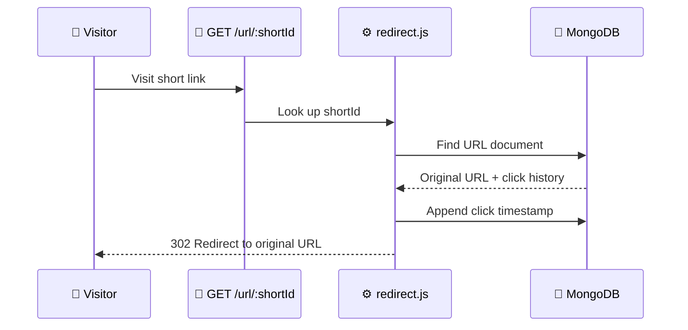
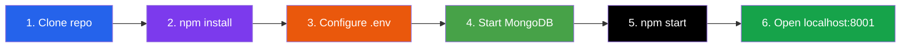
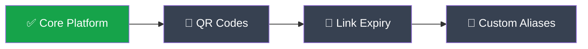

# 🔗 LinkSnap — URL Shortener

<p align="center">
  <strong>A full-stack URL shortening service with authentication, analytics, and an admin dashboard.</strong><br/>
  <sub>Shorten links, track every click, and manage your history — all from a responsive web UI.</sub>
</p>

<p align="center">


</p>

<p align="center">
  <a href="#-overview">Overview</a> •
  <a href="#-architecture">Architecture</a> •
  <a href="#-how-a-link-gets-created">Link Flow</a> •
  <a href="#-tech-stack">Tech Stack</a> •
  <a href="#-setup">Setup</a> •
  <a href="#-api-endpoints">API</a> •
  <a href="#️-roadmap">Roadmap</a>
</p>

---

## 🚀 Overview

**LinkSnap** turns long URLs into short, shareable links — with a full account system behind it. Every link is tied to a user, every click is logged, and admins get a platform-wide view of activity.

| Capability | Details |
|---|---|
| 🔗 URL Shortening | Long URLs → compact `nanoid`-based short codes |
| 📊 Click Analytics | Per-link visit counts with timestamp history |
| 🔐 Authentication | JWT-based login/signup with secure cookies |
| 🗂️ Link History | Search, browse, and manage all your links |
| 📋 Copy to Clipboard | One-click copy on every generated link |
| 📁 Export | Download your links as a `.txt` file |
| 🛡️ Admin Dashboard | Platform-wide overview for admin roles |
| 📱 Responsive UI | Mobile-first design across every page |

---

## ✨ Features

<table>
<tr>
<td width="50%" valign="top">

**🔗 Core Shortening**
- Convert long URLs into short, unique codes
- `nanoid` for collision-resistant ID generation
- Instant redirect on visit
- Copy-to-clipboard on every link

</td>
<td width="50%" valign="top">

**📊 Analytics & History**
- Per-link click counts + timestamps
- Searchable link history
- Analytics overview page (`/see-more`)
- Export all links to `.txt`

</td>
</tr>
<tr>
<td valign="top">

**🔐 Auth & Accounts**
- JWT-based signup/login
- Secure, httpOnly cookie sessions
- Role-based access (user vs. admin)
- Editable user profile & settings

</td>
<td valign="top">

**🛡️ Admin & Support**
- Admin-only dashboard (`/admin/urls`)
- Help center & FAQ pages
- Quick tips / notes page

</td>
</tr>
</table>

---

## 🏗️ Architecture



### Request Lifecycle



---

## 🔄 How a Link Gets Created



## 🔀 How a Redirect + Click Gets Logged



---

## 🧰 Tech Stack

| Layer | Technology |
|---|---|
| Frontend | EJS, CSS3, Bootstrap 5, JavaScript |
| Backend | Node.js, Express 5 |
| Database | MongoDB (Mongoose) |
| Auth | JSON Web Tokens (JWT) |
| ID Generation | nanoid |

---

## 📁 Project Structure

```text
URL-Shortener/
├── controllers/           # Route handlers
│   ├── account.js         # Profile management
│   ├── analytic.js        # Click analytics API
│   ├── redirect.js        # Short URL redirects
│   ├── shorturl.js        # URL creation
│   └── user.js            # Auth (login/signup)
├── middlewares/
│   └── auth.js            # JWT authentication & role checks
├── models/
│   ├── url.js              # URL schema
│   └── user.js             # User schema
├── public/
│   ├── css/main.css        # Global design system
│   ├── js/main.js          # Copy, FAQ, search utilities
│   └── views/
│       ├── partials/       # Shared navbar, footer, table
│       ├── home.ejs        # Dashboard
│       ├── history.ejs     # Link history
│       ├── login.ejs       # Login page
│       ├── signup.ejs      # Registration
│       ├── account.ejs     # User profile
│       ├── settings.ejs    # App settings
│       ├── see-more.ejs    # Analytics overview
│       ├── create-file.ejs # Export URLs
│       ├── save-urls.ejs   # Saved links view
│       ├── admin.ejs       # Admin dashboard
│       ├── help.ejs        # Help center
│       ├── faq.ejs         # FAQ page
│       └── notes.ejs       # Quick tips
├── routes/
│   ├── static.js           # Page routes
│   ├── posturl.js          # POST /url
│   ├── geturl.js           # GET /url/:shortId
│   └── user.js             # Auth routes
├── services/
│   └── auth.js             # JWT helpers
├── connect.js               # MongoDB connection
├── index.js                 # App entry point
├── .env                      # Environment variables
└── package.json
```

---

## 🗺️ Pages

| Route | Description | Auth Required |
|---|---|:---:|
| `/` | Dashboard — shorten URLs | ✅ |
| `/history` | View all your links | ✅ |
| `/see-more` | Analytics overview | ✅ |
| `/create-file` | Export links as text file | ✅ |
| `/save-urls` | Saved links view | ✅ |
| `/account` | Edit profile | ✅ |
| `/setting` | App settings | ✅ |
| `/notes` | Quick tips & notes | ✅ |
| `/help` | Help center | — |
| `/faq` | Frequently asked questions | — |
| `/login` | Sign in | — |
| `/signup` | Create account | — |
| `/admin/urls` | Admin dashboard | 🛡️ Admin only |
| `/url/:shortId` | Redirect to original URL | — |

---

## ⚙️ Setup

### Prerequisites

- [Node.js](https://nodejs.org/) v18+
- [MongoDB](https://www.mongodb.com/) running locally or a cloud instance

### Installation



**1. Clone the repository**

```bash
git clone https://github.com/Mohitkumar2217/URL-Shortener.git
cd URL-Shortener
```

**2. Install dependencies**

```bash
npm install
```

**3. Configure environment**

Create a `.env` file in the project root:

```env
PORT=8001
SECRET=your_jwt_secret_key_here
```

**4. Start MongoDB**

Make sure MongoDB is running at `mongodb://127.0.0.1:27017/urlshortener` (configured in `index.js`).

**5. Run the server**

```bash
npm start
```

**6. Open in browser**

```text
http://localhost:8001
```

---

## 🔌 API Endpoints

| Method | Endpoint | Description |
|---|---|---|
| `POST` | `/url` | Create a short URL |
| `GET` | `/url/:shortId` | Redirect to original URL |
| `GET` | `/url/analytic/:shortId` | Get click analytics JSON |
| `POST` | `/user` | Register a new user |
| `POST` | `/user/login` | Login |
| `GET` | `/logout` | Logout |

---

## 🔑 Environment Variables

| Variable | Description | Example |
|---|---|---|
| `PORT` | Server port | `8001` |
| `SECRET` | JWT signing secret | `my-super-secret-key` |

---

## 🛣️ Roadmap

**Shipped**
- [x] User authentication (JWT)
- [x] URL shortening & redirects
- [x] Click tracking & analytics
- [x] Responsive UI with all pages active
- [x] Link history & search
- [x] Export URLs
- [x] Admin dashboard

**Planned**
- [ ] QR code generation
- [ ] Link expiry dates
- [ ] Custom short aliases



---

## 🤝 Contributing

Pull requests are welcome. For major changes, please open an issue first to discuss what you'd like to change.

```bash
git checkout -b feature/your-feature
# make your changes
git commit -m "feat: describe your change"
git push origin feature/your-feature
```

--- 

## 👤 Author

Built by [Mohit Kumar](https://github.com/Mohitkumar2217)

<p align="center">
  <sub>🔗 Shorten it. Share it. Track it.</sub>
</p>